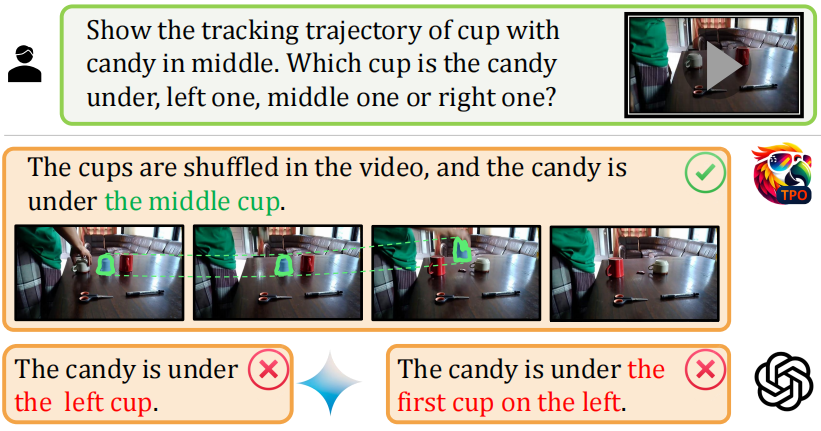
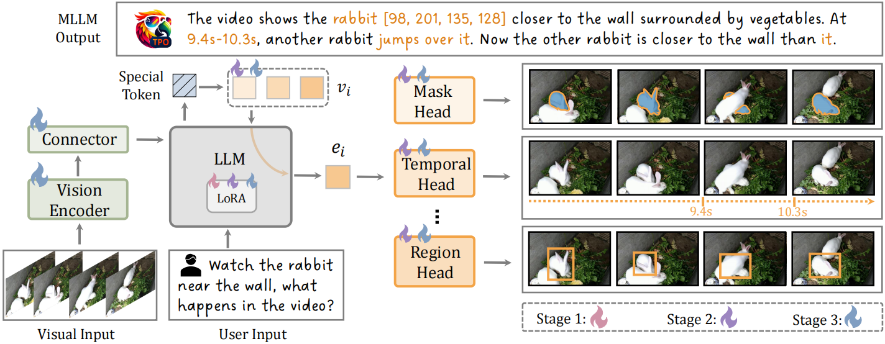

# 👫 TPO

<a src="https://img.shields.io/badge/cs.CV-2412.19326-b31b1b?logo=arxiv&logoColor=red" href="https://arxiv.org/abs/2412.19326"> 
</a> | <a src="https://img.shields.io/twitter/follow/opengvlab?style=social" href="https://twitter.com/opengvlab">
     </a>
</a> | [](https://huggingface.co/OpenGVLab/VideoChat-TPO)

## 💡 Introduction
Task Preference Optimization (TPO) is a new method designed to enhance the performance of multimodal large language models (MLLMs) in handling visual tasks. Current MLLMs face challenges in precisely understanding visuals despite their capabilities in various vision applications. TPO addresses this by integrating differentiable task preferences from fine-grained visual tasks, introducing learnable task tokens to bridge the gap between task-specific heads and the MLLM. This results in improved multimodal capabilities and task-specific performance, with significant improvements demonstrated across multiple benchmarks and tasks.
<p align="center">
    
    <p align="center">Figure 1: TPO uses differentiable task preferences from dense visual supervisions via task-specific heads to enhance MLLMs in fine-grained understanding.</p>
</p>

- Enhanced Multimodal Performance: Achieves an average **14.6%** improvement in multimodal performance compared to baseline models on various image and video tasks, and demonstrates scalability across different MLLM architectures such as [VideoChat](https://github.com/OpenGVLab/TPO?tab=readme-ov-file#-model-zoo) and LLaVA.
- Robust Zero-Shot Capabilities: Performs comparably to state-of-the-art supervised models in zero-shot scenarios across various vision tasks.
- Synergistic Training: Multi-task co-training within TPO leads to mutual benefits, enhancing individual task performance beyond single-task training.

<p />
<p align="center">
    
    <p>Figure 2: Overall Pipeline of TPO. The architecture of Task Preference Optimization (TPO) consists of four main components: (1) a vision encoder, (2) a connector, (3) a large language model, and (4) a series of visual task heads. Differently colored flame symbols indicate which components are unfrozen at various stages of the training process.</p>
</p>

## 🏃 Installation

1. Clone the repository:
```bash
git clone https://github.com/OpenGVLab/TPO.git
```
1. Navigate to the project directory:
```bash
cd TPO
```
3. Install the required dependencies:
```
pip install -r requirements.txt
```
4. Try the demo
```
python app.py
```

## 🤖 Model Zoo

| MLLM | Link | 
| ---  | ---  |
| VideoChat-TPO| [huggingface](https://huggingface.co/OpenGVLab/VideoChat-TPO)|
| LlaVA-OV-TPO | TBD |

## Citation

```
@article{yan2024tpo,
  title={Task Preference Optimization: Improving Multimodal Large Language Models with Vision Task Alignment},
  author={Yan, Ziang and Li, Zhilin and He, Yinan and Wang, Chenting and Li, Kunchang and Li, Xinhao and Zeng, Xiangyu and Wang, Zilei and Wang, Yali and Qiao, Yu, and Wang, Limin and Wang, Yi},
  journal={arXiv preprint arXiv:2412.19326},
  year={2024}
}
```

## Acknowledgement

TPO is built with reference to the following projects: [VideoChat](https://github.com/OpenGVLab/Ask-Anything), [Llava-OV](https://github.com/LLaVA-VL/LLaVA-NeXT), [UMT](https://github.com/LAION-AI/CLIP_benchmark), [InternVideo2](https://github.com/OpenGVLab/InternVideo), [CG-DETR](https://github.com/wjun0830/CGDETR), and [SAM2](https://github.com/facebookresearch/sam2). Thanks for their work!
